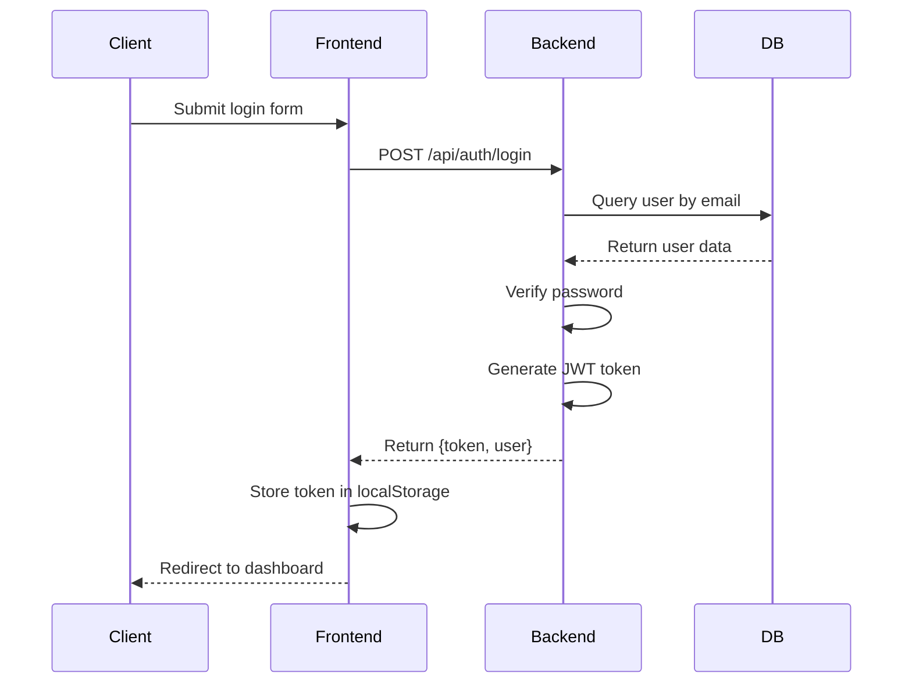
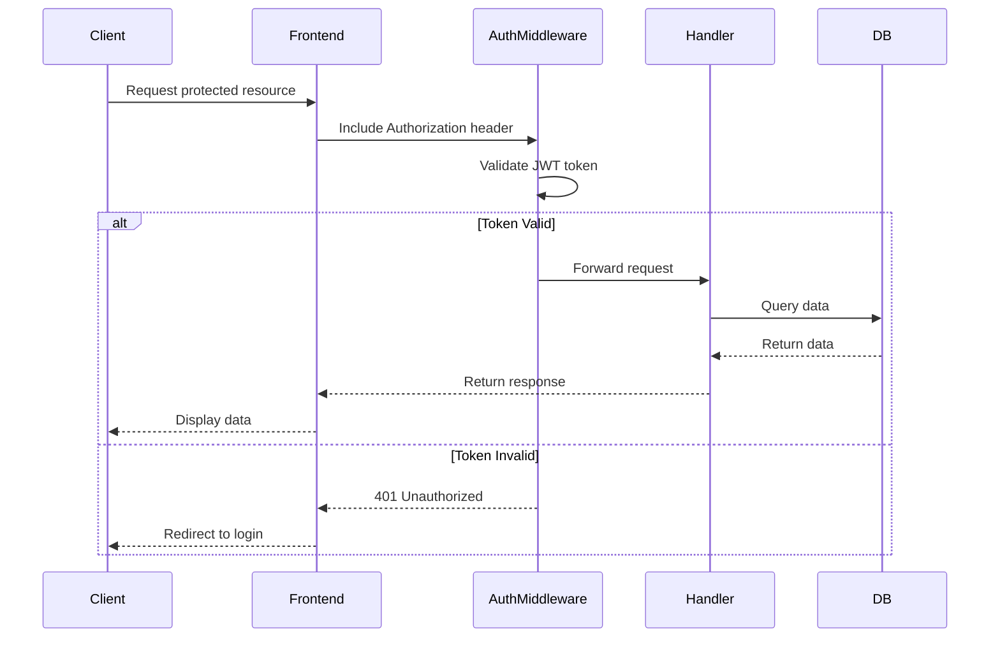

# Architecture Overview

## System Architecture

MiniDebet follows a modern microservices-inspired architecture with clear separation of concerns:

```diagram
┌─────────────────┐    HTTP/REST API    ┌─────────────────┐
│   Frontend      │ ←─────────────────→ │    Backend      │
│  (React/Vite)   │                     │   (Axum/Rust)   │
└─────────────────┘                     └─────────────────┘
         │                                       │
         │                                       │
         ▼                                       ▼
┌─────────────────┐                     ┌─────────────────┐
│   Browser       │                     │   Database      │
│                 │                     │   (SQLite)      │
└─────────────────┘                     └─────────────────┘
```

## Technology Stack

### Frontend

- **Framework**: React 18+ with TypeScript
- **Build Tool**: Vite
- **Styling**: Tailwind CSS
- **State Management**: React Context API
- **HTTP Client**: Axios/Fetch API

### Backend

- **Framework**: Axum (Rust web framework)
- **Database**: SQLite with SQLx ORM
- **Authentication**: JWT (JSON Web Tokens)
- **Serialization**: Serde
- **Password Hashing**: bcrypt
- **Async Runtime**: Tokio

### Shared

- **Types**: TypeScript interfaces shared between frontend and backend
- **Validation**: Zod schemas (planned)

## Component Structure

### Backend Modules

```sh
backend/src/
├── main.rs          # Application entry point
├── models/          # Database models and structs
│   ├── user.rs      # User entity
│   ├── client.rs    # Client entity
│   ├── invoice.rs   # Invoice and InvoiceItem entities
│   └── settings.rs  # User settings
├── handlers/        # API route handlers
│   ├── auth.rs      # Authentication endpoints
│   ├── user.rs      # User management
│   ├── client.rs    # Client management
│   └── invoice.rs   # Invoice operations
├── auth/            # Authentication logic
│   ├── jwt.rs       # JWT token handling
│   └── middleware.rs # Auth middleware
├── db/              # Database connection and setup
└── migrations/      # Database schema migrations
```

### Frontend Structure

```sh
frontend/src/
├── components/      # Reusable UI components
│   ├── LoginForm.tsx
│   ├── RegisterForm.tsx
│   └── Navbar.tsx
├── pages/          # Page components
│   └── Dashboard.tsx
├── contexts/       # React contexts
│   └── AuthContext.tsx
├── services/       # API service layer
│   └── api.ts
├── App.tsx         # Main application component
└── main.tsx        # Entry point
```

## Data Flow

### Authentication Flow



### Protected Route Access



## Database Schema

### Core Tables

#### Users Table

```sql
CREATE TABLE users (
    id TEXT PRIMARY KEY,
    email TEXT UNIQUE NOT NULL,
    password_hash TEXT NOT NULL,
    first_name TEXT,
    last_name TEXT,
    company_name TEXT,
    tax_id TEXT,
    created_at TIMESTAMP,
    updated_at TIMESTAMP
);
```

#### Clients Table

```sql
CREATE TABLE clients (
    id TEXT PRIMARY KEY,
    user_id TEXT NOT NULL,
    name TEXT NOT NULL,
    email TEXT,
    company TEXT,
    street TEXT,
    city TEXT,
    postal_code TEXT,
    country TEXT,
    vat_number TEXT,
    created_at TIMESTAMP,
    updated_at TIMESTAMP,
    FOREIGN KEY(user_id) REFERENCES users(id)
);
```

#### Invoices Table

```sql
CREATE TABLE invoices (
    id TEXT PRIMARY KEY,
    user_id TEXT NOT NULL,
    client_id TEXT NOT NULL,
    invoice_number TEXT UNIQUE NOT NULL,
    issue_date DATE NOT NULL,
    due_date DATE NOT NULL,
    currency TEXT NOT NULL DEFAULT 'EUR',
    subtotal REAL NOT NULL,
    tax_rate REAL NOT NULL DEFAULT 19.0,
    tax_amount REAL NOT NULL,
    total_amount REAL NOT NULL,
    status TEXT NOT NULL DEFAULT 'draft',
    notes TEXT,
    created_at TIMESTAMP,
    updated_at TIMESTAMP,
    FOREIGN KEY(user_id) REFERENCES users(id),
    FOREIGN KEY(client_id) REFERENCES clients(id)
);
```

#### Invoice Items Table

```sql
CREATE TABLE invoice_items (
    id TEXT PRIMARY KEY,
    invoice_id TEXT NOT NULL,
    description TEXT NOT NULL,
    quantity INTEGER NOT NULL,
    unit_price REAL NOT NULL,
    total_price REAL NOT NULL,
    created_at TIMESTAMP,
    FOREIGN KEY(invoice_id) REFERENCES invoices(id)
);
```

## Security Considerations

### Authentication & Authorization

- JWT tokens with 24-hour expiration
- Password hashing with bcrypt (cost factor 12)
- Protected routes via middleware
- Role-based access control (planned)

### Data Protection

- HTTPS in production
- Input validation and sanitization
- SQL injection prevention via prepared statements
- CORS configuration for frontend security

### Best Practices Implemented

- Environment variables for secrets
- Secure password storage
- Rate limiting (planned)
- Input validation (planned)

## Scalability Considerations

### Current Architecture

- Single database instance (SQLite)
- Monolithic backend application
- Static frontend deployment

### Future Scaling Options

1. **Database**: Migrate to PostgreSQL for better concurrency
2. **Caching**: Add Redis for session storage and caching
3. **Load Balancing**: Deploy multiple backend instances
4. **CDN**: Serve static assets through CDN
5. **Microservices**: Split backend into separate services

## Deployment Architecture

### Production Setup

```diagram
Internet → Load Balancer → Reverse Proxy (Nginx) → Application Servers
                                    ↓
                              Static Files (Frontend)
                                    ↓
                              Database Server
```

### Cloud Deployment Options

- **Frontend**: Vercel, Netlify, or Cloudflare Pages
- **Backend**: AWS EC2, DigitalOcean, or Railway
- **Database**: Managed PostgreSQL service
- **Monitoring**: Sentry, Datadog, or custom logging

## Performance Optimizations

### Implemented

- Async/await for non-blocking operations
- Connection pooling for database queries
- Efficient serialization with Serde
- Compiled Rust backend for maximum performance

### Planned

- Database indexing for frequent queries
- Pagination for large datasets
- Caching strategies
- Asset compression and bundling

## Error Handling Strategy

### **Backend**

- Structured error responses with status codes
- Logging with tracing crate
- Graceful degradation for non-critical failures

### **Frontend**

- User-friendly error messages
- Automatic retry mechanisms
- Fallback UI states

## Monitoring & Observability

### Current

- Basic logging with tracing
- Health check endpoint (`/health`)

### **Planned**

- Application performance monitoring
- Database query performance tracking
- User analytics
- Error tracking and alerting
