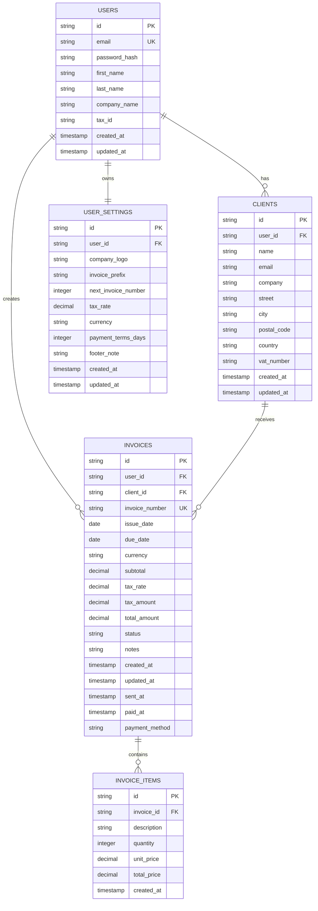

# Database Design Documentation

## Overview

MiniDebet uses SQLite as its primary database with a normalized relational schema designed for efficient querying and data integrity. The schema supports German invoicing requirements including VAT calculations, client management, and comprehensive audit trails.

## Entity Relationship Diagram



## Table Specifications

### Users Table

**Purpose**: Store user account information and authentication data.

```sql
CREATE TABLE users (
    id TEXT PRIMARY KEY,
    email TEXT UNIQUE NOT NULL,
    password_hash TEXT NOT NULL,
    first_name TEXT,
    last_name TEXT,
    company_name TEXT,
    tax_id TEXT,
    created_at DATETIME DEFAULT CURRENT_TIMESTAMP,
    updated_at DATETIME DEFAULT CURRENT_TIMESTAMP
);
```

**Columns:**

- `id`: UUID v4 identifier
- `email`: Unique email address (indexed)
- `password_hash`: bcrypt hashed password
- `first_name`: User's first name
- `last_name`: User's last name
- `company_name`: Business/company name
- `tax_id`: Tax identification number
- `created_at`: Record creation timestamp
- `updated_at`: Last modification timestamp

**Indexes:**

- Primary key on `id`
- Unique constraint on `email`

### Clients Table

**Purpose**: Store client/customer information for invoicing.

```sql
CREATE TABLE clients (
    id TEXT PRIMARY KEY,
    user_id TEXT NOT NULL,
    name TEXT NOT NULL,
    email TEXT,
    company TEXT,
    street TEXT,
    city TEXT,
    postal_code TEXT,
    country TEXT DEFAULT 'DE',
    vat_number TEXT,
    created_at DATETIME DEFAULT CURRENT_TIMESTAMP,
    updated_at DATETIME DEFAULT CURRENT_TIMESTAMP,
    FOREIGN KEY(user_id) REFERENCES users(id) ON DELETE CASCADE
);
```

**Columns:**

- `id`: UUID v4 identifier
- `user_id`: Reference to owning user
- `name`: Client contact name
- `email`: Client email address
- `company`: Client company name
- `street`: Street address
- `city`: City
- `postal_code`: Postal/ZIP code
- `country`: Country code (default: DE)
- `vat_number`: VAT identification number
- `created_at`: Record creation timestamp
- `updated_at`: Last modification timestamp

**Indexes:**

- Primary key on `id`
- Foreign key on `user_id`
- Index on `user_id` for fast lookups

### Invoices Table

**Purpose**: Store invoice headers and financial information.

```sql
CREATE TABLE invoices (
    id TEXT PRIMARY KEY,
    user_id TEXT NOT NULL,
    client_id TEXT NOT NULL,
    invoice_number TEXT UNIQUE NOT NULL,
    issue_date DATE NOT NULL,
    due_date DATE NOT NULL,
    currency TEXT NOT NULL DEFAULT 'EUR',
    subtotal DECIMAL(10,2) NOT NULL,
    tax_rate DECIMAL(5,2) NOT NULL DEFAULT 19.00,
    tax_amount DECIMAL(10,2) NOT NULL,
    total_amount DECIMAL(10,2) NOT NULL,
    status TEXT NOT NULL DEFAULT 'draft',
    notes TEXT,
    created_at DATETIME DEFAULT CURRENT_TIMESTAMP,
    updated_at DATETIME DEFAULT CURRENT_TIMESTAMP,
    sent_at DATETIME,
    paid_at DATETIME,
    payment_method TEXT,
    FOREIGN KEY(user_id) REFERENCES users(id) ON DELETE CASCADE,
    FOREIGN KEY(client_id) REFERENCES clients(id) ON DELETE RESTRICT
);
```

**Columns:**

- `id`: UUID v4 identifier
- `user_id`: Reference to owning user
- `client_id`: Reference to client
- `invoice_number`: Unique invoice number (e.g., "INV-2024-001")
- `issue_date`: Invoice creation date
- `due_date`: Payment due date
- `currency`: Currency code (default: EUR)
- `subtotal`: Sum of line items before tax
- `tax_rate`: VAT percentage (7% or 19% typically)
- `tax_amount`: Calculated tax amount
- `total_amount`: Final amount including tax
- `status`: draft | sent | paid | overdue | cancelled
- `notes`: Additional invoice notes
- `created_at`: Record creation timestamp
- `updated_at`: Last modification timestamp
- `sent_at`: When invoice was sent to client
- `paid_at`: When payment was received
- `payment_method`: How payment was received

**Indexes:**

- Primary key on `id`
- Unique constraint on `invoice_number`
- Foreign keys on `user_id` and `client_id`
- Indexes on `user_id`, `client_id`, and `status`

### Invoice Items Table

**Purpose**: Store individual line items for invoices.

```sql
CREATE TABLE invoice_items (
    id TEXT PRIMARY KEY,
    invoice_id TEXT NOT NULL,
    description TEXT NOT NULL,
    quantity INTEGER NOT NULL,
    unit_price DECIMAL(10,2) NOT NULL,
    total_price DECIMAL(10,2) NOT NULL,
    created_at DATETIME DEFAULT CURRENT_TIMESTAMP,
    FOREIGN KEY(invoice_id) REFERENCES invoices(id) ON DELETE CASCADE
);
```

**Columns:**

- `id`: UUID v4 identifier
- `invoice_id`: Reference to parent invoice
- `description`: Item description
- `quantity`: Number of units
- `unit_price`: Price per unit
- `total_price`: Quantity × Unit price (cached for performance)
- `created_at`: Record creation timestamp

**Indexes:**

- Primary key on `id`
- Foreign key on `invoice_id`
- Index on `invoice_id` for fast item retrieval

### User Settings Table

**Purpose**: Store user-specific configuration and preferences.

```sql
CREATE TABLE user_settings (
    id TEXT PRIMARY KEY,
    user_id TEXT NOT NULL UNIQUE,
    company_logo TEXT,
    invoice_prefix TEXT DEFAULT 'INV',
    next_invoice_number INTEGER DEFAULT 1,
    tax_rate DECIMAL(5,2) DEFAULT 19.00,
    currency TEXT DEFAULT 'EUR',
    payment_terms_days INTEGER DEFAULT 30,
    footer_note TEXT,
    created_at DATETIME DEFAULT CURRENT_TIMESTAMP,
    updated_at DATETIME DEFAULT CURRENT_TIMESTAMP,
    FOREIGN KEY(user_id) REFERENCES users(id) ON DELETE CASCADE
);
```

**Columns:**

- `id`: UUID v4 identifier
- `user_id`: Reference to user (unique constraint)
- `company_logo`: Path/URL to company logo
- `invoice_prefix`: Prefix for invoice numbers
- `next_invoice_number`: Next sequential invoice number
- `tax_rate`: Default VAT rate for new invoices
- `currency`: Default currency
- `payment_terms_days`: Default payment terms in days
- `footer_note`: Default footer text for invoices
- `created_at`: Record creation timestamp
- `updated_at`: Last modification timestamp

**Indexes:**

- Primary key on `id`
- Unique constraint on `user_id`
- Foreign key on `user_id`

## Migration Files

### Migration 0001: Create Users Table

```sql
-- Create users table
CREATE TABLE users (
    id TEXT PRIMARY KEY,
    email TEXT UNIQUE NOT NULL,
    password_hash TEXT NOT NULL,
    first_name TEXT,
    last_name TEXT,
    company_name TEXT,
    tax_id TEXT,
    created_at DATETIME DEFAULT CURRENT_TIMESTAMP,
    updated_at DATETIME DEFAULT CURRENT_TIMESTAMP
);

-- Create indexes
CREATE INDEX idx_users_email ON users(email);
```

### Migration 0002: Create Clients Table

```sql
-- Create clients table
CREATE TABLE clients (
    id TEXT PRIMARY KEY,
    user_id TEXT NOT NULL,
    name TEXT NOT NULL,
    email TEXT,
    company TEXT,
    street TEXT,
    city TEXT,
    postal_code TEXT,
    country TEXT DEFAULT 'DE',
    vat_number TEXT,
    created_at DATETIME DEFAULT CURRENT_TIMESTAMP,
    updated_at DATETIME DEFAULT CURRENT_TIMESTAMP,
    FOREIGN KEY(user_id) REFERENCES users(id) ON DELETE CASCADE
);

-- Create indexes
CREATE INDEX idx_clients_user_id ON clients(user_id);
```

### Migration 0003: Create Invoices Table

```sql
-- Create invoices table
CREATE TABLE invoices (
    id TEXT PRIMARY KEY,
    user_id TEXT NOT NULL,
    client_id TEXT NOT NULL,
    invoice_number TEXT UNIQUE NOT NULL,
    issue_date DATE NOT NULL,
    due_date DATE NOT NULL,
    currency TEXT NOT NULL DEFAULT 'EUR',
    subtotal DECIMAL(10,2) NOT NULL,
    tax_rate DECIMAL(5,2) NOT NULL DEFAULT 19.00,
    tax_amount DECIMAL(10,2) NOT NULL,
    total_amount DECIMAL(10,2) NOT NULL,
    status TEXT NOT NULL DEFAULT 'draft',
    notes TEXT,
    created_at DATETIME DEFAULT CURRENT_TIMESTAMP,
    updated_at DATETIME DEFAULT CURRENT_TIMESTAMP,
    sent_at DATETIME,
    paid_at DATETIME,
    payment_method TEXT,
    FOREIGN KEY(user_id) REFERENCES users(id) ON DELETE CASCADE,
    FOREIGN KEY(client_id) REFERENCES clients(id) ON DELETE RESTRICT
);

-- Create indexes
CREATE INDEX idx_invoices_user_id ON invoices(user_id);
CREATE INDEX idx_invoices_client_id ON invoices(client_id);
CREATE INDEX idx_invoices_status ON invoices(status);
CREATE INDEX idx_invoices_issue_date ON invoices(issue_date);
```

### Migration 0004: Create Invoice Items Table

```sql
-- Create invoice_items table
CREATE TABLE invoice_items (
    id TEXT PRIMARY KEY,
    invoice_id TEXT NOT NULL,
    description TEXT NOT NULL,
    quantity INTEGER NOT NULL,
    unit_price DECIMAL(10,2) NOT NULL,
    total_price DECIMAL(10,2) NOT NULL,
    created_at DATETIME DEFAULT CURRENT_TIMESTAMP,
    FOREIGN KEY(invoice_id) REFERENCES invoices(id) ON DELETE CASCADE
);

-- Create indexes
CREATE INDEX idx_invoice_items_invoice_id ON invoice_items(invoice_id);
```

### Migration 0005: Create User Settings Table

```sql
-- Create user_settings table
CREATE TABLE user_settings (
    id TEXT PRIMARY KEY,
    user_id TEXT NOT NULL UNIQUE,
    company_logo TEXT,
    invoice_prefix TEXT DEFAULT 'INV',
    next_invoice_number INTEGER DEFAULT 1,
    tax_rate DECIMAL(5,2) DEFAULT 19.00,
    currency TEXT DEFAULT 'EUR',
    payment_terms_days INTEGER DEFAULT 30,
    footer_note TEXT,
    created_at DATETIME DEFAULT CURRENT_TIMESTAMP,
    updated_at DATETIME DEFAULT CURRENT_TIMESTAMP,
    FOREIGN KEY(user_id) REFERENCES users(id) ON DELETE CASCADE
);

-- Create indexes
CREATE INDEX idx_user_settings_user_id ON user_settings(user_id);
```

## Database Constraints

### Foreign Key Constraints

- Cascade delete on user deletion (clients, invoices, settings)
- Restrict delete on client with existing invoices
- Automatic cleanup of orphaned records

### Check Constraints

- Status values: draft, sent, paid, overdue, cancelled
- Currency codes: EUR, USD, etc.
- Tax rates: 0.00 to 100.00
- Positive amounts only

### Triggers

**Update timestamps trigger:**

```sql
CREATE TRIGGER update_users_updated_at 
    AFTER UPDATE ON users
    FOR EACH ROW 
    BEGIN
        UPDATE users SET updated_at = CURRENT_TIMESTAMP WHERE id = OLD.id;
    END;
```

Similar triggers exist for clients, invoices, and user_settings tables.

## Performance Considerations

### Indexing Strategy

- Primary keys on all tables
- Foreign key indexes for JOIN operations
- Composite indexes for common query patterns
- Unique constraints where appropriate

### Query Optimization

- Denormalized calculated fields (total_price in invoice_items)
- Pre-calculated totals in invoices table
- Efficient pagination using LIMIT/OFFSET
- Proper use of WHERE clauses

### Data Types

- TEXT for UUIDs and variable-length strings
- DECIMAL for monetary values (precision: 10,2)
- INTEGER for counts and IDs
- DATETIME for timestamps
- DATE for calendar dates

## Backup and Recovery

### Backup Strategy

```bash
# Daily backup
sqlite3 minidebet.db ".backup 'backups/minidebet_$(date +%Y%m%d).db'"

# Point-in-time recovery
sqlite3 minidebet.db ".restore backups/minidebet_20240115.db"
```

### Maintenance Commands

```sql
-- Analyze query performance
ANALYZE;

-- Check database integrity
PRAGMA integrity_check;

-- Optimize database
VACUUM;
```

## Security Considerations

### Data Protection

- Passwords stored as bcrypt hashes
- No sensitive data in logs
- Regular security audits
- Parameterized queries to prevent SQL injection

### Access Control

- Row-level security through user_id foreign keys
- Application-level permission checks
- Audit trails for all modifications

## Future Enhancements

### Planned Schema Changes

1. **Audit Trail Table**: Track all data modifications
2. **Payment Records Table**: Detailed payment history
3. **Recurring Invoices Table**: Template for recurring billing
4. **Attachments Table**: Document storage for invoices
5. **Tax Zones Table**: Support for different tax jurisdictions

### Scalability Improvements

- Partitioning large tables
- Read replicas for reporting
- Connection pooling optimization
- Caching layer implementation
